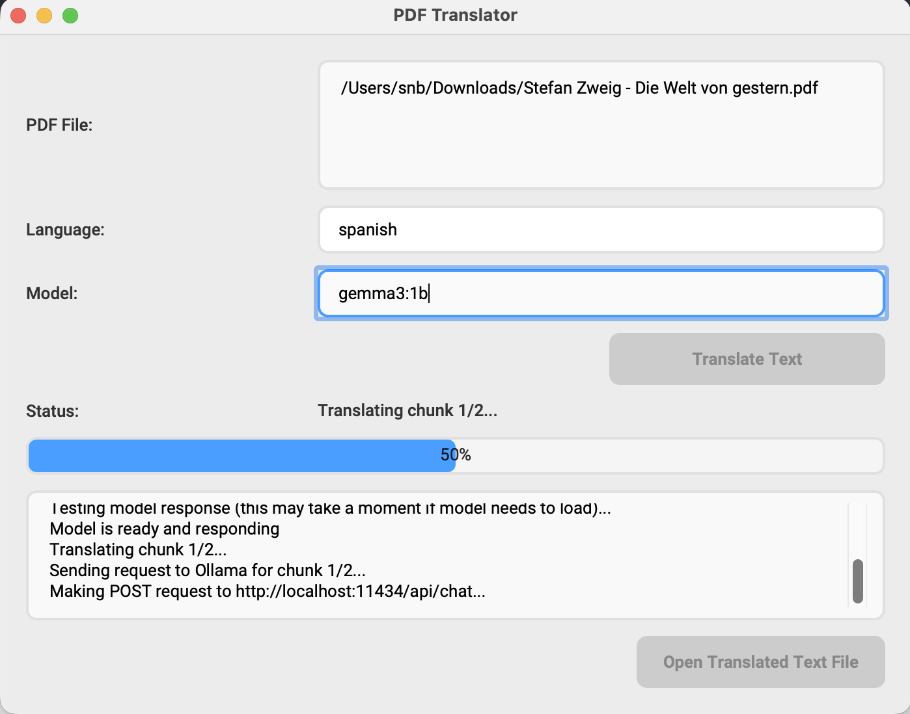

# PDF GPT - Local LLM Translation Tool

<div align="center" style="margin-bottom: 20px;">
Open Source, free (as in freedom), PDF Translation tool using a locally running LLM via ollama.
</div>

<div align="center">
  
</div>

## Overview

PDF GPT is a PyQt5-based desktop application that extracts text from PDF files and translates it to any target language using locally running Ollama language models. The application features a modern, intuitive interface with drag-and-drop functionality, real-time progress tracking, and seamless background processing.

## Table of Contents

- [Prerequisites](#-prerequisites)
- [Installation](#️-installation)
- [Ollama](#starting-ollama)
- [Usage](#usage)
- [Changelog](#changelog)
- [Contributing](#-contributing)
- [License](#-license)

## Prerequisites

Before running the application, ensure you have:

- **Python 3.6 or higher** installed on your system
- **Ollama** installed and at least one model downloaded (see installation steps below)
- **Required Python packages**: `PyPDF2`, `ollama`, `PyQt5`, `requests` (see installation steps)

## Installation

### Step 1: Install Ollama

1. Visit [https://ollama.ai](https://ollama.ai) and download Ollama for your operating system
2. Install Ollama following the instructions for your platform
3. Verify installation by opening a terminal and running:
   ```bash
   ollama --version
   ```

### Step 2: Download an Ollama Model

Before using the application, you need to download at least one Ollama model. Recommended models:

```bash
# Small, fast model (good for testing)
ollama pull gemma3:1b

# Medium-sized, balanced model
ollama pull llama2

# Larger, more capable model
ollama pull mistral
```

You can browse all available models at [https://ollama.ai/library](https://ollama.ai/library).

### Step 3: Install Python Dependencies

1. **Clone the repository**:
   ```bash
   git clone https://github.com/loyft/pdf-gpt.git
   cd pdf-gpt
   ```

2. **Install required Python libraries**:
   ```bash
   pip install -r requirements.txt
   ```
   
   Or install manually:
   ```bash
   pip install PyPDF2 ollama PyQt5 requests
   ```

## Starting Ollama

**Important**: Ollama must be running before you start the PDF GPT application.

### How to Start Ollama

**Option 1: Desktop Application (Recommended)**
- **macOS**: Launch Ollama from Applications folder. It will start automatically in the background.
- **Windows**: Launch Ollama from the Start menu. The app runs in the system tray.
- **Linux**: Launch the Ollama desktop app if installed.

**Option 2: Command Line**
- Open a terminal and run:
  ```bash
  ollama serve
  ```
  Keep this terminal window open while using the PDF GPT.

### Verify Ollama is Running

To verify Ollama is running correctly, open a terminal and run:

```bash
curl http://localhost:11434/api/tags
```

You should see a JSON response listing your installed models. If you get a connection error, Ollama is not running.

**Note**: The Ollama desktop application typically starts automatically when you log in. The PDF GPT connects to Ollama at `http://localhost:11434` by default.

## Usage


1. **Ensure Ollama is running** (see [Starting Ollama](#-starting-ollama) section above)
2. **Launch the PDF GPT**:
   ```bash
   python main.py
   ```

2. **Drag and drop a PDF file** into the "PDF File" area at the top of the window
3. **Enter the target language** (e.g., `english`, `spanish`, `german`, `french`)
4. **Enter the Ollama model name** (e.g., `llama2`, `mistral`, `gemma3:1b`)
   - Must be a model you've downloaded with `ollama pull`
   - The application will verify the model exists before starting translation
5. **Click "Translate Text"** 
6. **When done you can open the translated file in the same directory as the original file**:
`originalname_targetlanguage.txt`


## Changelog

### Version 0.2.0 
- Improved UI/UX
- Background threading to prevent freezing issues
- Improved output file naming
- Custom model input instead of predefined (limited) dropdown menu
- Real-time progress tracking
- Improved error handling and connection verification

### Version 0.1.2
- Added drag-and-drop PDF functionality
- Added model selection dropdown
- File output with option to open translated file
- Basic error handling

### Version 0.1.1
- Initial release
- Basic PDF text extraction
- Translation using OpenAI GPT models
- Command-line interface with basic translation functionality

## Contributing
Contributions are welcome, please raise an issue or create a pull request. :)


## License

This project is licensed under the MIT License - see the [LICENSE](LICENSE) file for details.

